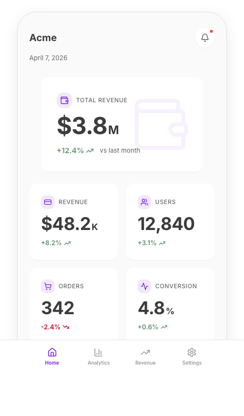
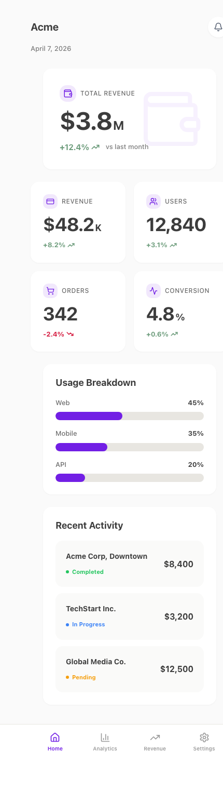

<div align="center">

<br />

# styleseed

### AI가 UI/UX 디자이너처럼 코딩하게 만들어주는 디자인 룰셋

**디자이너 없이, 바이브코딩만으로 프로 수준 UI를 만들 수 있습니다.**

<br />

[사용법](#사용법) · [왜-필요한가](#왜-필요한가) · [AI-스킬-10개](#ai-스킬-10개) · [Wiki](../../wiki)

<br />

</div>

---

## 30초 설명

Claude Code한테 "대시보드 만들어줘" 하면 보통 이런 결과가 나옵니다:

> 간격 제각각, 폰트 크기 뒤죽박죽, 색 남발, 카드 구조 없음. 기능은 되는데 촌스러움.

**StyleSeed를 쓰면:**

<div align="center">
  
  <br />
  <em>Claude Code + Toss seed로 생성. 디자이너 개입 0.</em>
</div>

<details>
<summary><strong>전체 페이지 보기</strong></summary>
<div align="center">
  
</div>
</details>

<br />

차이점? AI한테 **디자이너의 판단 기준**을 심어준 것.

## 사용법

### 방법 1: Claude Code한테 URL만 던지기 (가장 쉬움)

```
"https://github.com/bitjaru/styleseed 이거 디자인 시스템으로 쓰고 SaaS 대시보드 만들어줘"
```

끝. Claude Code가 알아서 디자인 규칙을 읽고 적용합니다.

### 방법 2: 프로젝트에 복사 (계속 쓸 때)

```bash
cp -r seeds/toss/* your-project/
```

`CLAUDE.md`를 자동으로 읽어서 모든 컴포넌트가 디자인 규칙을 따릅니다.

## 왜 필요한가

### 모두가 겪는 문제

AI 코딩 도구는 기능적인 UI를 잘 만듭니다. 하지만 **기능적 ≠ 아름다운**.

디자인 규칙 없이 AI가 만든 UI:
- 간격이 제각각 (여기 16px, 저기 20px, 또 14px)
- 타이포그래피 계층 없음 (폰트 크기/두께 뒤죽박죽)
- 시각적 리듬 없음 (카드가 다 똑같음)
- 색 남용 (컬러가 너무 많거나 대비가 안 맞음)

**디자이너를 고용하거나... StyleSeed를 쓰거나.**

### StyleSeed이 다른 점

토큰만 주는 게 아닙니다. AI한테 **디자인 감각** 자체를 심어줍니다:

| 레이어 | 역할 |
|--------|------|
| **디자인 언어** | 구체적 시각 규칙 — 컬러 철학, 숫자 비율, 카드 구조, 페이지 구성, 금지 패턴 |
| **디자인 토큰** | 색상, 타이포, 간격, 그림자, 모션, 테두리 — 라이트 & 다크 모드 |
| **CSS 테마** | Tailwind CSS v4 구현체 |
| **컴포넌트** | UI 프리미티브 31개 + 패턴 컴포넌트 16개 |
| **AI 스킬** | Claude Code 슬래시 명령어 10개 |

### 이런 규칙이 차이를 만듭니다

```
규칙: 숫자는 항상 크게, 단위는 항상 작게 — 2:1 비율.
      48px 숫자 + 24px 단위. 같은 크기 금지.

규칙: 앱 전체에서 강조 색상은 딱 하나. 나머지는 전부 회색.
      강조 색은 활성/선택 상태에만 사용.

규칙: 순수 검정(#000) 절대 금지. 가장 어두운 색은 #2A2A2A.
      5단계 그레이: #2A → #3C → #6A → #7A → #9B

규칙: 모든 콘텐츠는 카드 안에. 페이지 배경에 직접 배치 금지.
      카드(#FFF)와 배경(#FAFAFA)의 차이가 자연스러운 구분선.

규칙: 같은 섹션 타입을 연속으로 반복 금지.
      높은 섹션과 낮은 섹션을 교대해서 시각적 리듬 만들기.

규칙: 카드 그림자는 겨우 보일 정도 (opacity 4-8%).
      그림자가 눈에 확 띄면 너무 강한 거.
```

이건 수십 개 규칙 중 6개. [전체 디자인 언어 보기 →](seeds/toss/DESIGN-LANGUAGE.md)

## AI 스킬 10개

seed를 복사하면 **슬래시 명령어 10개**를 쓸 수 있습니다 — UI 6개 + UX 4개:

### UI 스킬 — 잘 만들기

| 스킬 | 기능 |
|------|------|
| `/ui-component` | 디자인 규칙에 맞는 새 컴포넌트 생성 |
| `/ui-page` | 모바일 페이지 스캐폴딩 |
| `/ui-pattern` | UI 패턴 조합 (카드 그리드, 테이블, 차트) |
| `/ui-review` | 디자인 시스템 위반 감사 |
| `/ui-tokens` | 디자인 토큰 조회/추가/수정 |
| `/ui-a11y` | 접근성 감사 (WCAG 2.2 AA) |

### UX 스킬 — 잘 설계하기 (디자이너 없이)

| 스킬 | 기능 |
|------|------|
| `/ux-flow` | 유저 플로우 설계 (점진적 공개, 정보 피라미드) |
| `/ux-audit` | 닐슨 10대 사용성 원칙으로 UX 평가 |
| `/ux-copy` | UX 마이크로카피 생성 (버튼, 에러, 빈 상태, 토스트) |
| `/ux-feedback` | 4가지 피드백 상태 추가 (로딩, 빈 상태, 에러, 성공) |

### 워크플로우 예시

```bash
# 1. 플로우 설계
> /ux-flow "이메일 인증 포함 온보딩"

# 2. 페이지 생성
> /ui-page Onboarding "3단계 온보딩: 이름, 이메일 인증, 설정"

# 3. UX 카피 생성
> /ux-copy "온보딩 — 버튼 라벨, 에러 메시지, 성공 상태"

# 4. 피드백 상태 추가
> /ux-feedback src/pages/Onboarding.tsx

# 5. 전체 검토
> /ux-audit src/pages/Onboarding.tsx
> /ui-review src/pages/Onboarding.tsx
```

결과: 디자이너 없이 만든, 전문적이고 접근성 좋은 온보딩 플로우.

## StyleSeed + awesome-design-md

[awesome-design-md](https://github.com/VoltAgent/awesome-design-md)는 AI가 읽는 DESIGN.md 파일 모음입니다. **우리는 이것 위에 더 깊이 갑니다.**

| | DESIGN.md | StyleSeed |
|---|-----------|-----------|
| **역할** | 브랜드 토큰 (피부) | 디자인 감각 (뇌) |
| **AI에게 가르치는 것** | 어떤 색/폰트를 쓸지 | 어떻게 디자이너처럼 생각할지 |
| **컴포넌트** | 없음 | 47개 |
| **AI 스킬** | 없음 | 10개 |
| **레이아웃 규칙** | 없음 | 섹션 타입, 정보 피라미드, 시각적 리듬 |
| **금지 패턴** | 없음 | 수십 개의 "이러면 안 됨" 규칙 |

**같이 쓰면 시너지:**

```bash
# Stripe의 브랜드 아이덴티티 + 토스의 디자인 규칙
cp awesome-design-md/designs/stripe/DESIGN.md your-project/
cp -r styleseed/seeds/toss/* your-project/
```

## 사용 가능한 Seed

| Seed | 스타일 | 포함 내용 | 상태 |
|------|--------|----------|------|
| **[toss](seeds/toss/)** | 토스 스타일 모바일 핀테크 | 47 컴포넌트, 10 스킬, 전체 룰셋 | **사용 가능** |
| apple | Apple HIG 스타일 | — | 준비 중 |
| linear | Linear 앱 스타일 | — | 준비 중 |
| stripe | Stripe 대시보드 | — | 준비 중 |

## 문서

상세 문서는 **[Wiki](../../wiki)**에 있습니다 — 디자인 규칙, 페이지 구성 레시피, 차트 가이드 등.

## 기여하기

### Claude Code로 새 Seed 만들기

1. `cp -r seeds/_template seeds/your-style`
2. Claude Code에서 해당 폴더 열기
3. Claude에게: *"`seeds/toss/`를 참고해서 [Linear / Apple / Material] 스타일 디자인 언어 만들어줘"*
4. Claude가 디자인 규칙, 토큰, CSS 테마, 패턴 컴포넌트 생성
5. PR 제출

[`seeds/_template/GUIDE.md`](seeds/_template/GUIDE.md)에 상세 가이드가 있습니다.

## 라이선스

[MIT](LICENSE)
