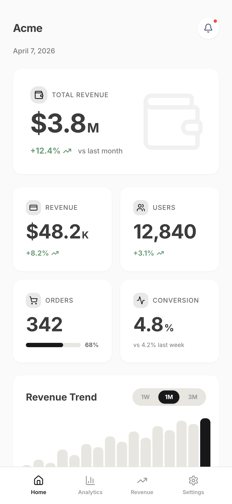
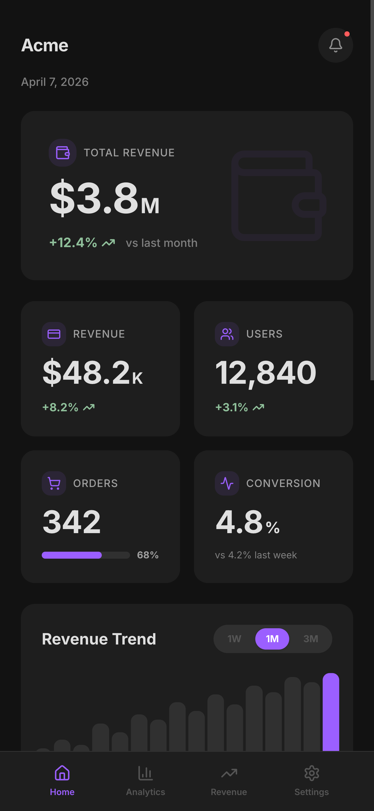
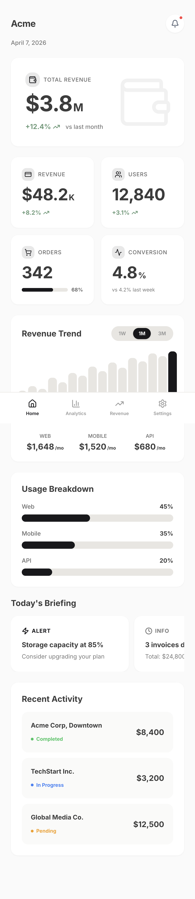
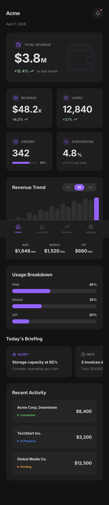

<div align="center">

<br />

# styleseed

### Make AI code like a UI/UX designer.


**A design engine that teaches Claude Code and Cursor how to think like a designer.**<br />
Pick any brand skin. Get professional UI. No designer needed.

<br />

[Get Started](#get-started) · [Engine + Skins](#how-it-works-engine--skins) · [Skills](#11-ai-powered-skills) · [Wiki](../../wiki) · [한국어](README-KR.md)

<br />

</div>

---

## What is StyleSeed?

AI coding tools generate functional UI — but it looks generic. The missing piece isn't components or color tokens. **It's design judgment.**

StyleSeed is a **design engine** — 69 visual design rules, 48 components, and 11 AI skills that teach AI how professional designers think:

```
"The most refined black isn't #000 — it's #2A2A2A"
"One accent color in the entire app. Everything else grayscale. Restraint is elegance."
"Shadows at 4% opacity. If you can see it, it's already too much."
"Numbers and units at 2:1 ratio. 48px number, 24px unit. Always."
"Never repeat the same section type twice. Alternate tall and compact for rhythm."
```

The engine is **brand-agnostic** — pair it with any color skin and it works.

<div align="center">
  &nbsp;&nbsp;&nbsp;&nbsp;
  <br />
  <em>Same engine, different skins. Built with Claude Code. Zero designer.</em>
</div>

<details>
<summary><strong>See full page</strong></summary>
<div align="center">
  &nbsp;&nbsp;&nbsp;&nbsp;
</div>
</details>

## Get Started

### Option 1: Interactive Setup (Recommended)

```bash
# Copy the engine into your project
cp -r engine/* your-project/

# Run the setup wizard
/ui-setup
```

The wizard walks you through:
1. App type (SaaS, e-commerce, fintech...)
2. Brand color or pick a skin (Toss, Stripe, Linear, Vercel, Notion...)
3. Or fetch any brand from [awesome-design-md](https://github.com/VoltAgent/awesome-design-md) (58+ brands)
4. Font preference
5. Generates your first page automatically

### Option 2: Manual Setup

```bash
# Copy engine (rules, components, skills)
cp -r engine/* your-project/

# Copy engine css to src/styles
cp -r engine/css/* your-project/src/styles/

# Pick a skin — copy theme.css alongside other css files
cp skins/stripe/theme.css your-project/src/styles/theme.css

# Copy components
cp -r engine/components/* your-project/src/components/
```

### Option 3: Just give AI the URL

```
Refer to https://github.com/bitjaru/styleseed — read engine/CLAUDE.md 
and engine/DESIGN-LANGUAGE.md, then build a SaaS dashboard.
Use skins/stripe/theme.css for the color palette.
```

### Option 4: Cursor

```bash
cp engine/.cursorrules your-project/.cursorrules
```

## How It Works: Engine + Skins

```
┌─────────────────────────────────────────────────┐
│  StyleSeed Engine (brand-agnostic)              │
│                                                 │
│  69 design rules · 48 components · 11 skills    │
│  Layout · Composition · Typography · UX · A11y  │
└──────────────────────┬──────────────────────────┘
                       │
              Pick a skin ↓
                       │
    ┌──────┬──────┬──────┬──────┬──────┬─────────┐
    │ Toss │Stripe│Linear│Vercel│Notion│ 58 more │
    │      │      │      │      │      │(awesome)│
    └──────┴──────┴──────┴──────┴──────┴─────────┘
```

**Engine** = how your app is structured (design intelligence)
- 69 visual design rules (layout, composition, rhythm, forbidden patterns)
- 48 React components (32 primitives + 16 patterns)
- 11 Claude Code skills (setup, UI, UX, accessibility)
- Works with ANY color palette

**Skin** = what your app looks like (visual identity)
- Just a `theme.css` file with color variables
- 5 built-in skins: Toss, Stripe, Linear, Vercel, Notion
- 58+ more available from [awesome-design-md](https://github.com/VoltAgent/awesome-design-md)
- Or create your own (change `--brand` and you're done)

### StyleSeed vs awesome-design-md

They're **complementary**, not competing:

| | [awesome-design-md](https://github.com/VoltAgent/awesome-design-md) | StyleSeed |
|---|---|---|
| **What it is** | Brand color palette collection | Design intelligence engine |
| **Provides** | Colors, fonts, shadow values | Layout rules, composition recipes, UX patterns |
| **Components** | None | 48 React components |
| **AI Skills** | None | 11 slash commands |
| **Makes AI understand** | "Use this shade of blue" | "How to structure a page like a pro designer" |

**awesome-design-md** = paint colors<br/>
**StyleSeed** = architecture + interior design rules

Use them together: awesome-design-md provides the skin, StyleSeed provides the brain.

## Available Skins

| Skin | Style | Source |
|------|-------|--------|
| **[toss](skins/toss/)** | Korean fintech — purple, minimal, data-focused | Original |
| **[stripe](skins/stripe/)** | Professional — indigo, clean, multi-layer shadows | awesome-design-md |
| **[linear](skins/linear/)** | Dark-first — violet, minimal, developer-focused | awesome-design-md |
| **[vercel](skins/vercel/)** | Monochrome — black & white, geometric | awesome-design-md |
| **[notion](skins/notion/)** | Warm — blue accent, friendly, warm neutrals | awesome-design-md |
| **[58+ more](skins/_from-awesome-design-md/)** | Any brand from awesome-design-md | Auto-fetch via `/ui-setup` |

## Engine Contents

```
engine/
├── CLAUDE.md                 # AI reads this automatically
├── DESIGN-LANGUAGE.md        # 69 visual design rules (brand-agnostic)
├── .claude/skills/           # 11 slash commands
│   ├── ui-setup/             #   Interactive setup wizard
│   ├── ui-component/         #   Generate components
│   ├── ui-page/              #   Scaffold pages
│   ├── ui-pattern/           #   Compose layouts
│   ├── ui-review/            #   Design compliance check
│   ├── ui-tokens/            #   Manage tokens
│   ├── ui-a11y/              #   Accessibility audit
│   ├── ux-flow/              #   Design user flows
│   ├── ux-audit/             #   UX heuristic evaluation
│   ├── ux-copy/              #   Generate microcopy
│   └── ux-feedback/          #   Add loading/error/empty states
├── components/
│   ├── ui/                   # 32 primitives (shadcn/ui + motion)
│   └── patterns/             # 16 dashboard patterns
├── css/                      # base.css, fonts.css, index.css
├── tokens/                   # 6 JSON token files
├── utils/                    # Formatting utilities
├── icons/                    # Custom SVG icon library
└── scaffold/                 # Vite 6 + React 18 starter
```

## 11 AI-Powered Skills

### Setup
| Skill | What It Does |
|-------|-------------|
| `/ui-setup` | **Interactive wizard** — pick skin, brand color, font, generates first page |

### UI — Build It Right
| Skill | What It Does |
|-------|-------------|
| `/ui-component` | Generate components following design conventions |
| `/ui-page` | Scaffold pages with proper layout structure |
| `/ui-pattern` | Compose UI patterns (card grid, chart, list) |
| `/ui-review` | Audit code for design system violations |
| `/ui-tokens` | View, add, or modify design tokens |
| `/ui-a11y` | Accessibility audit (WCAG 2.2 AA) |

### UX — Design It Right (No Designer Needed)
| Skill | What It Does |
|-------|-------------|
| `/ux-flow` | Design user flows (progressive disclosure, information pyramid) |
| `/ux-audit` | Nielsen's 10 usability heuristics evaluation |
| `/ux-copy` | Generate UX microcopy (buttons, errors, empty states, toasts) |
| `/ux-feedback` | Add loading/success/error/empty states to any component |

### Example Workflow

```bash
/ui-setup                    # Pick skin, configure project
/ui-page Dashboard           # Scaffold main page
/ux-copy "dashboard"         # Generate all microcopy
/ux-feedback src/Dashboard   # Add loading/error states
/ux-audit src/Dashboard      # Check UX quality
/ui-review src/Dashboard     # Check design compliance
```

## Example Design Rules

These are the kind of rules that make AI output look professional:

```
Rule: The most refined black isn't #000 — it's #2A2A2A.
      5-level grayscale: #2A → #3C → #6A → #7A → #9B

Rule: All content lives inside cards. Never on page background.
      Card (#FFF) vs background (#FAFAFA) contrast IS the separator.

Rule: Never repeat the same section type consecutively.
      Hero → Grid → Chart → Carousel → List (visual rhythm)

Rule: KPI cards must vary: 2 with trend arrows, 1 with progress bar,
      1 with comparison text. Never 4 identical cards.

Rule: Information density increases as you scroll down.
      Top: 48px (one number) → Bottom: 14px (detailed lists)
```

69 rules total. [See the full design language →](engine/DESIGN-LANGUAGE.md)

## Tech Stack

React 18 · TypeScript · Tailwind CSS v4 · Radix UI · Vite 6 · Lucide Icons · CVA

## Documentation

Full docs in the **[Wiki](../../wiki)** — design rules reference, composition recipes, chart guides, skills reference.

## Contributing

### Create a New Skin

Just a `theme.css` + `skin.json`:
```bash
mkdir skins/your-brand
# Copy any existing skin as starting point
cp skins/toss/theme.css skins/your-brand/theme.css
# Change the --brand color and other values
```

### Improve the Engine

Better rules → better AI output:
- More specific design rules
- New pattern components
- Accessibility improvements
- New AI skills

See [CONTRIBUTING.md](CONTRIBUTING.md) for details.

## License

[MIT](LICENSE)

## Acknowledgments

- Design language inspired by [Toss](https://toss.im/design-system)
- Components based on [shadcn/ui](https://ui.shadcn.com/)
- Brand skins sourced from [awesome-design-md](https://github.com/VoltAgent/awesome-design-md)
- UX principles from [Laws of UX](https://lawsofux.com/) and [Nielsen Norman Group](https://www.nngroup.com/)
