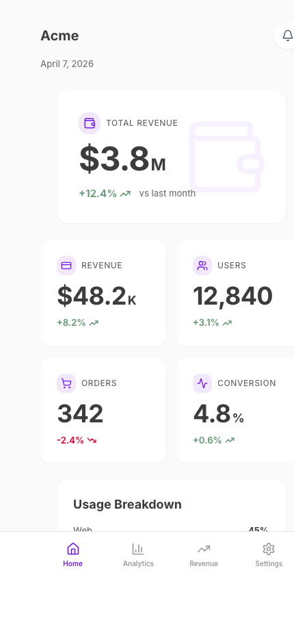

<div align="center">

<br />

# styleseed

### Stop tweaking AI-generated UI. Start designing it.

**2,200+ lines of design rules that make Claude Code produce professional-quality UI.**<br />
No designer needed. No pixel-pushing. Just copy a seed and build.

<br />

[Get Started](#get-started) · [Why StyleSeed](#why-styleseed) · [Skills](#10-ai-powered-skills) · [Showcase](#showcase) · [awesome-design-md](#styleseed--awesome-design-md)

<br />



*This dashboard was generated with Claude Code + Toss seed. Zero designer involvement.*

</div>

---

## The 30-Second Pitch

You ask Claude Code to build a dashboard. Without a design system, you get this:

> Generic cards, inconsistent spacing, random font sizes, no visual hierarchy. It *works* — but it looks like a hackathon project.

With a **StyleSeed**, you get this:

<div align="center">
  
</div>

> Toss-style cards with subtle shadows, 5-level grayscale typography, big numbers with small units at 2:1 ratio, proper information pyramid, consistent 6px grid spacing. It looks like a **professional designer built it**.

The difference? **2,200 lines of design rules** that teach AI how to think like a designer.

## Get Started

```bash
# Copy the toss seed into your project
cp -r seeds/toss/* your-project/
```

That's it. Claude Code reads `CLAUDE.md` automatically. Every component now follows the design language.

```
> "Build a SaaS dashboard with revenue chart, user stats, and recent activity"
```

Claude Code produces a pixel-perfect, Toss-style mobile dashboard — because it now understands 60 visual design rules, not just component APIs.

## Why StyleSeed

### The Problem Everyone Has

AI coding tools are amazing at generating functional UI. But **functional ≠ beautiful**.

Without design opinions, AI produces:
- Random spacing (16px here, 20px there, 14px somewhere else)
- Inconsistent typography (no hierarchy, wrong weights)
- No visual rhythm (cards that don't breathe)
- Generic interactions (hover effects on everything)
- Amateur color usage (too many colors, wrong contrast)

**You need a designer... or you need a StyleSeed.**

### What Makes StyleSeed Different

A seed isn't just tokens. It's a complete **design brain** for AI:

| Layer | What It Does | Lines |
|-------|-------------|-------|
| **Design Language** | 60 specific visual rules (color philosophy, number display ratios, card structure, forbidden patterns) | 2,200+ |
| **Design Tokens** | Colors, typography, spacing, shadows, motion, border radius — light & dark mode | 195 |
| **CSS Theme** | Tailwind CSS v4 implementation with semantic tokens | 370 |
| **Components** | 31 UI primitives (shadcn/ui-based) + 16 pattern components | 3,400+ |
| **AI Skills** | 10 Claude Code slash commands for UI generation, review, and UX design | 690 |

### Example Rules That Make the Difference

These are the kind of rules that separate professional UI from generic AI output:

```
Rule: Numbers are always big, units are always small — 2:1 ratio.
      48px number + 24px unit. Never the same size.

Rule: Only ONE accent color in the entire app. Everything else is grayscale.
      The accent color is ONLY for active/selected states.

Rule: Never use pure black (#000000). Darkest text is #2A2A2A.
      5-level grayscale: #2A → #3C → #6A → #7A → #9B

Rule: All content lives inside cards. Never place content directly on 
      the page background. The contrast between card (#FFF) and 
      background (#FAFAFA) IS the visual separator.

Rule: No dropdown selectors inside cards. 2-4 options = pill toggle.
      5+ options = separate page. No exceptions.

Rule: Card shadows are barely visible (opacity 4-8%). 
      If you can clearly see the shadow, it's too strong.
```

A designer would take weeks to document all this. We did it in 2,200 lines. Claude Code reads it in seconds.

## 10 AI-Powered Skills

After copying a seed, you get **10 slash commands** — 6 for UI, 4 for UX:

### UI Skills — Build It Right

| Skill | What It Does |
|-------|-------------|
| `/ui-component` | Generate a new component following all design conventions |
| `/ui-page` | Scaffold a complete mobile page with proper layout structure |
| `/ui-pattern` | Compose a UI pattern (card grid, data table, chart card) |
| `/ui-review` | Audit existing code for design system violations |
| `/ui-tokens` | View, add, or modify design tokens (keeps JSON + CSS in sync) |
| `/ui-a11y` | Full accessibility audit — WCAG 2.2 AA compliance |

### UX Skills — Design It Right (No Designer Needed)

| Skill | What It Does |
|-------|-------------|
| `/ux-flow` | Design user flows using proven UX patterns (progressive disclosure, hub & spoke, information pyramid) |
| `/ux-audit` | Evaluate screens against Nielsen's 10 usability heuristics + mobile UX best practices |
| `/ux-copy` | Generate UX microcopy — button labels, error messages, empty states, toasts — in Toss's casual-but-polite voice |
| `/ux-feedback` | Add all 4 feedback states to any component: skeleton loading, empty state, error recovery, success toast |

The UX skills encode principles from **Nielsen's heuristics, Fitts's Law, Hick's Law, Miller's Law**, and modern mobile UX patterns — so you don't have to know them.

### Workflow Example

```bash
# 1. Design the flow
> /ux-flow "User onboarding with email verification"

# 2. Build the pages
> /ui-page Onboarding "3-step onboarding: name, email verification, preferences"

# 3. Add proper UX copy
> /ux-copy "onboarding flow — button labels, error messages, success states"

# 4. Add feedback states
> /ux-feedback src/pages/Onboarding.tsx

# 5. Review everything
> /ux-audit src/pages/Onboarding.tsx
> /ui-review src/pages/Onboarding.tsx
```

Result: A professionally designed, accessible, UX-optimized onboarding flow — **without a designer**.

## Showcase

<div align="center">
  
</div>

> Built entirely with Claude Code + Toss seed. Zero designer involvement. The design rules handle color philosophy, typography hierarchy, spacing, card structure, and information pyramid automatically.

## StyleSeed + awesome-design-md

[awesome-design-md](https://github.com/VoltAgent/awesome-design-md) (23K+ stars) popularized DESIGN.md — plain-text design docs for AI agents. **We love it. We build on it.**

### How They're Different

| | DESIGN.md | StyleSeed |
|---|-----------|-----------|
| **What it is** | Brand identity tokens (~100 lines) | Complete design brain (2,200+ lines) |
| **Teaches AI** | What colors/fonts to use | How to think like a designer |
| **Components** | None | 31 primitives + 16 patterns |
| **AI Skills** | None | 10 Claude Code slash commands |
| **Layout rules** | None | 4 section types, information pyramid |
| **UX guidance** | None | Nielsen's heuristics, microcopy, feedback states |
| **"Don't" rules** | None | 30+ forbidden patterns that prevent amateur mistakes |

### Using Both Together (Recommended)

They're **complementary**, not competing:

```bash
# Stripe's visual identity + Toss's deep design rules
cp awesome-design-md/designs/stripe/DESIGN.md your-project/
cp -r styleseed/seeds/toss/* your-project/

# Now AI knows Stripe's brand colors AND professional layout/UX rules
```

**DESIGN.md** = what your app looks like (brand identity)<br/>
**StyleSeed** = how your app is structured (design intelligence)

## Available Seeds

| Seed | Style | What's Included | Status |
|------|-------|----------------|--------|
| **[toss](seeds/toss/)** | Toss-style mobile fintech | 31 UI + 16 patterns, 60 rules, 10 skills | **Ready** |
| apple | Apple HIG-inspired | — | Coming Soon |
| linear | Linear app-style | — | Coming Soon |
| stripe | Stripe dashboard | — | Coming Soon |

## What's in the Toss Seed

```
seeds/toss/
├── CLAUDE.md                 # AI reads this automatically
├── DESIGN-LANGUAGE.md        # 2,200+ lines of visual design rules
├── .claude/skills/           # 10 slash commands (6 UI + 4 UX)
├── tokens/                   # 6 JSON token files
├── css/                      # Tailwind CSS v4 theme (light + dark)
├── components/
│   ├── ui/                   # 31 shadcn/ui-based primitives
│   └── patterns/             # 16 dashboard patterns
├── utils/                    # Formatting utilities
├── icons/                    # Custom SVG icon library
└── scaffold/                 # Vite 6 + React 18 starter
```

### Tech Stack

React 18 · TypeScript · Tailwind CSS v4 · Radix UI · Vite 6 · Lucide Icons · CVA

### Customize in 1 Line

```css
:root {
  --brand: #721FE5;  /* ← Change this. Everything else adapts. */
}
```

## Contributing

### Create a New Seed (with Claude Code)

The fastest way to contribute:

1. `cp -r seeds/_template seeds/your-style`
2. Open Claude Code in `seeds/your-style/`
3. Tell Claude: *"Look at `seeds/toss/` as a reference. Create a [Linear / Apple / Material]-style design language."*
4. Claude generates: design rules, tokens, CSS theme, pattern components
5. Submit a PR

See [`seeds/_template/GUIDE.md`](seeds/_template/GUIDE.md) for the full guide.

### Improve the Toss Seed

Better design rules → better AI output. PRs welcome for:
- More specific rules (the more specific, the better AI follows them)
- New pattern components
- Accessibility improvements
- Dark mode fixes

## License

[MIT](LICENSE)

## Acknowledgments

- Design language inspired by [Toss](https://toss.im/design-system)
- Components based on [shadcn/ui](https://ui.shadcn.com/)
- DESIGN.md concept from [awesome-design-md](https://github.com/VoltAgent/awesome-design-md)
- UX principles from [Laws of UX](https://lawsofux.com/) and [Nielsen Norman Group](https://www.nngroup.com/)
