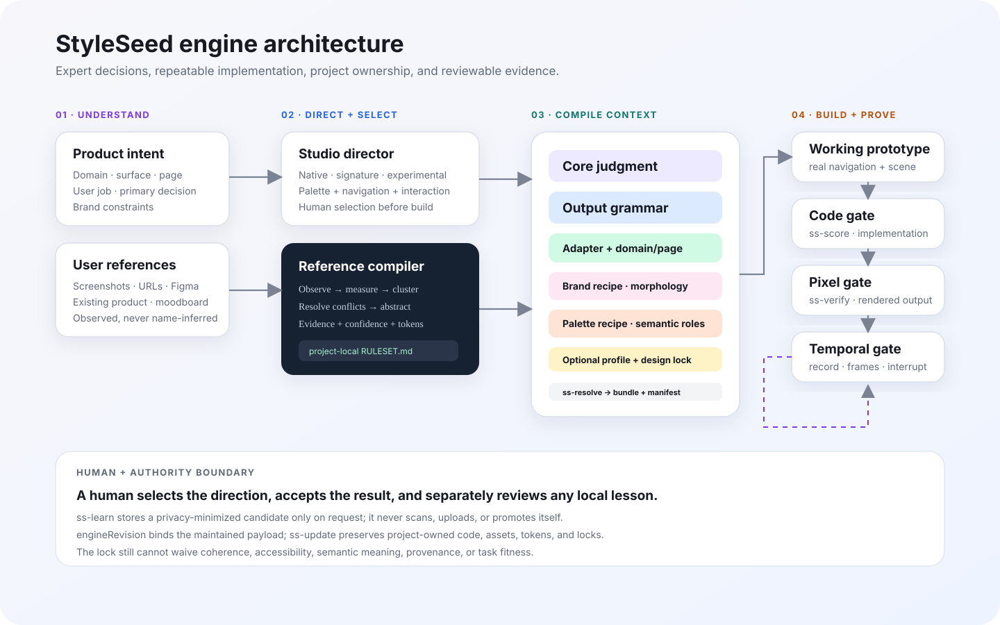
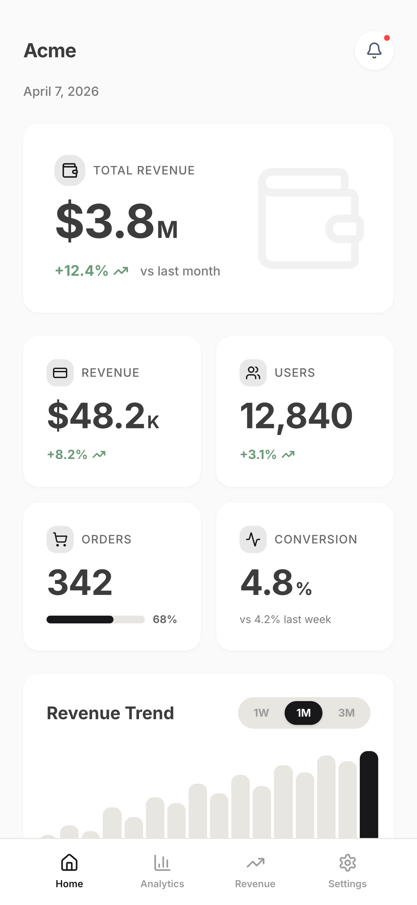
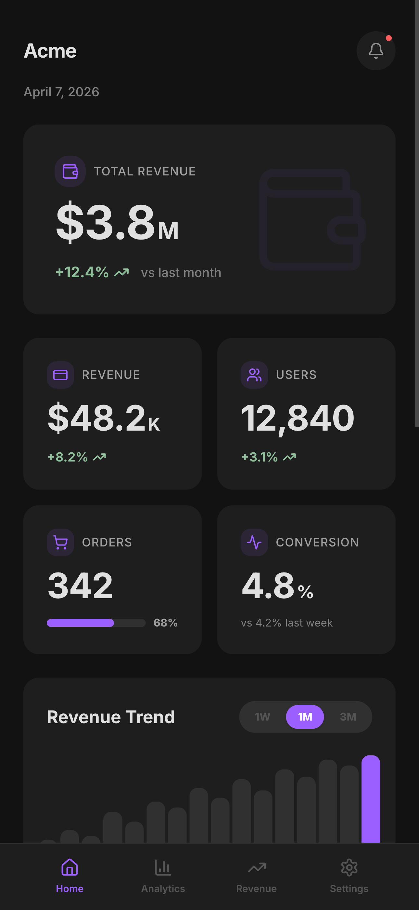
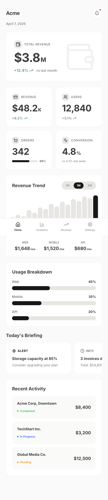
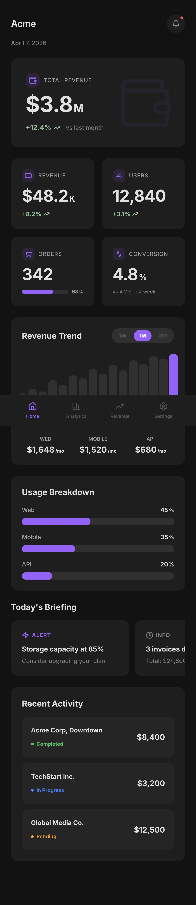

<div align="center">

<br />

# StyleSeed

### Teach your AI fixed design judgment.<br />Not one fixed aesthetic.

<sub>Your AI coding agent sets up the design system, a scored gate keeps the quality, and the decisions live in your repo, maintained across screens and sessions — <b>designed-looking products without a design team</b>. Open source, for Claude Code · Codex · Cursor.</sub>

<br />
<br />

<a href="https://styleseed-demo.vercel.app/showcase">
  
</a>

**Same product. Same prompt. Only the rules changed.**

</div>

**Measured on 120 rendered benchmark cells:** the enforced gate improved both Codex and Claude Code by **+5.3 points**. Raw rules alone were inconsistent (Codex +1.6, Claude Code −3.7), which is why StyleSeed ships a render → score → revise loop—not a prompt dump. **[Read BENCH-V1 and inspect the raw evidence →](https://styleseed-demo.vercel.app/gate)**

## Easy Start (30 seconds)

**1. Open your project in Claude Code, Codex, Cursor, or another coding agent.**

**2. Paste this message:**

```text
Install StyleSeed with `npx skills add bitjaru/styleseed`, then set it up for this project. Ask what I am building and only the design choices you need. Choose the right output grammar, brand recipe, and semantic palette—or derive a local grammar from my references. For a full concept with three directions, image/video jobs, and a working interaction reel, use `/ss-studio` in Claude Code or `$ss-studio` in Codex. Otherwise resolve the approved direction with `/ss-resolve` or `$ss-resolve`, build with one clear focal point, score to at least 80, then render and visually verify it before showing me.
```

**3. Approve the install, answer the short setup questions, and describe what you want to build.**
StyleSeed handles the design lock, build, code gate, and visual check. No design-system knowledge required.

| Agent | If you want to run it manually |
|---|---|
| **Claude Code** | `/ss-studio` for exploration, or `/ss-setup` → `/ss-build` for a decided screen |
| **Codex** | `$ss-studio` for exploration, or `$ss-setup` → `$ss-build` from `/skills` |
| **Cursor and others** | Paste the message above or use the installed skill picker |

[Claude Code guide](https://styleseed-demo.vercel.app/claude-code-ui-design) · [Codex guide](https://styleseed-demo.vercel.app/codex-ui-design) · [See examples](https://styleseed-demo.vercel.app/showcase) · [Need help?](#troubleshooting--i-applied-styleseed-but-the-ui-still-looks-bad)

## What it bans on sight

The "AI-generated look" isn't bad luck — it's a list of nameable tells. StyleSeed ships **74 rules** that ban them, and a **0–100 scored gate** that tells an installed agent to revise screens below 80 before presentation. The gate is enforced when the StyleSeed build workflow is actually invoked; a markdown file alone cannot block delivery.

| Banned | Why |
|---|---|
| Default indigo `#4F46E5` / `#5E6AD2` accent | the universal "an AI made this" color |
| Emoji as UI icons 🚗 🧺 ⭐ | inject random colors, render differently per OS |
| The icon-in-a-chip above every feature card | gen-1 AI tell — decoration pretending to be information |
| All-even grid of same-weight centered cards | the #1 machine-composed tell: no focal point |
| Pure `#000` backgrounds | a flat void — real dark UIs use layered ramps |
| Font sizes outside one fixed table | size drift is why screens feel "off" but you can't say why |
| Hardcoded hex in components | tokens only — otherwise the lock can't hold across screens |

<sub>Banning the defaults isn't enough — agents converge on new uniforms once the old ones are blocked. That's why the rules come with an enforced score-then-fix loop, not a checklist. [What happens after install ↓](#what-happens-after-easy-start)</sub>

<div align="center">

<br />

<a href="https://styleseed-demo.vercel.app">
  
</a>

**One component. Three token skins.** Same chat UI morphing across Toss · Raycast · Arc-inspired
token sets. A skin changes color and type material; a StyleSeed brand recipe changes the actual
geometry, containment, controls, collections, density, and motion.

<sub>Skins are *inspired-by* token sets, not recreations. [Compare the nine structural recipes →](https://styleseed-demo.vercel.app/recipes)</sub>

<br />

[](https://styleseed-demo.vercel.app)
&nbsp;
[](https://styleseed-demo.vercel.app/motion)


[](https://github.com/bitjaru/styleseed/stargazers)
[](https://github.com/bitjaru/styleseed/blob/main/LICENSE)
[](https://github.com/maxbogo/awesome-ai-tools-for-ui)

<br />

**StyleSeed fixes the design method — not one Toss-like aesthetic.**

**Judgment, not data** — how designers *think*, not a palette collection &nbsp;·&nbsp;
**Right grammar for the result** — consumer service, operations, technical, editorial,
commerce, institutional, marketing, or sequential story &nbsp;·&nbsp;
**Real morphology choices** — nine brand recipes change structure and component selection,
not just palette &nbsp;·&nbsp;
**Generative palette engine** — any key color becomes OKLCH ramps, context-fit surfaces,
a scored companion, semantic roles, contrast evidence, CSS tokens, and media anchors; eight
recipes remain maintained product postures &nbsp;·&nbsp;
**Studio pipeline** — three directions, human selection, interaction scenes, image/video jobs,
working prototype, and a prototype-first reel &nbsp;·&nbsp;
**References become rules** — `/ss-reference` compiles screenshots, URLs, Figma, or an existing
UI into an evidence-backed project grammar &nbsp;·&nbsp;
**Only the context you need** — `/ss-resolve` compiles the chosen method into a small,
hash-verifiable project bundle &nbsp;·&nbsp;
**Beyond web UI** — adapters for product UI, social carousels, decks, documents, and graphics &nbsp;·&nbsp;
**Fights the AI tells** — the default indigo, the icon-chip cliché, template layouts, rainbow lists &nbsp;·&nbsp;
**Auxiliary proof gates** — code score + rendered pixel verification before you see it &nbsp;·&nbsp;
**Every agent** — ships `CLAUDE.md` + `AGENTS.md` + `.cursorrules` &nbsp;·&nbsp;
**A design lock that stops drift** &nbsp;·&nbsp;
**Free & MIT**

<br />

<a href="engine/ARCHITECTURE.md">
  
</a>

<sub>Core judgment × output grammar × surface adapter × domain/page × brand recipe × palette recipe × optional profile. [Read the architecture →](engine/ARCHITECTURE.md)</sub>

<br /><br />


<sub>Full pages: [before](showcase/v26-before.png) · [after](showcase/v26-after.png) · **[more before/afters →](https://styleseed-demo.vercel.app/why)**</sub>

<sub>🔥 We ran an early version of *this page* through our own gate. **[It scored 58/100 → here's the receipt](https://styleseed-demo.vercel.app/scorecard)**</sub>

<br /><br />


<sub>Same product, six looks — each one `/ss-restyle <preset>` away. Coherent, distinct, never generic.</sub>

<br />

[Easy Start](#easy-start-30-seconds) · [Studio](https://styleseed-demo.vercel.app/studio) · [Palettes](https://styleseed-demo.vercel.app/palettes) · [Claude Code UI guide](https://styleseed-demo.vercel.app/claude-code-ui-design) · [Codex UI guide](https://styleseed-demo.vercel.app/codex-ui-design) · [Brand recipes](https://styleseed-demo.vercel.app/recipes) · [Architecture](engine/ARCHITECTURE.md) · [Engine + Recipes + Skins](#how-it-works-engine--recipes--skins) · [Motion](#named-motion-system) · [Skills](#23-ai-powered-skills) · [Wiki](../../wiki) · [한국어](README-KR.md)

<br />

</div>

---

## What happens after Easy Start

**Why the prompt installs first:** the context compiler and quality gates can only *run* when the
skills are installed. Installing turns `STYLESEED.md` into a small source-hashed rule bundle,
then actually scores and fixes the result before you see it. Without installation,
[`llms.txt`](https://styleseed-demo.vercel.app/llms.txt) still tells any agent how StyleSeed is
structured and where its machine-readable catalog lives, but compilation and gates become a
weaker manual path. Works with **Claude Code (`CLAUDE.md`), Codex / Amp / Gemini CLI
(`AGENTS.md`), and Cursor (`.cursorrules`)** — StyleSeed ships all three. (Planning first is what
keeps the result from looking random — see [Troubleshooting](#troubleshooting--i-applied-styleseed-but-the-ui-still-looks-bad).)

**What your agent actually does with StyleSeed loaded:**

```text
you    ▸  build me a billing settings page
agent  ▸  (plan mode) key color? for billing I'd go deep teal — #0F766E, mood: sharp · calm ·
          trustworthy (not the default indigo). Motion: Snap. ok?  ▸ y
agent  ▸  ✓ wrote STYLESEED.md — skin, accent, font, radius, motion locked for project-scoped visual work
agent  ▸  building… running the quality gate before I show you anything
gate   ▸  ✗ two accent colors   ✗ "normal" rows colored   ✗ no empty state   → fixing
agent  ▸  ✓ 88/100 — one accent, grey normal states, real empty/error states. here's the page.
```

**The `STYLESEED.md` lock is the anti-drift mechanic.** Your skin, key color, radius, and motion get written once. Installed project instructions and StyleSeed skills re-read it for visual work, so those decisions can survive new screens and sessions. When the build workflow runs, the Quality Gate reviews and fixes the UI (rainbow lists, two accents, missing states) before presentation — and it can [retrofit an old generic build](#already-built-something-generic-retrofit-it) too.

> **The method stays open and portable.** The sources are plain markdown; installation adds the
> deterministic context compiler, manifest, and executable gates. If installation is unavailable,
> [`llms.txt`](https://styleseed-demo.vercel.app/llms.txt) gives any agent the portable routing
> contract, but it cannot provide the same reproducible local compile by itself.

**Want the 23 core agent skills too** (the `styleseed` router plus 22 `ss-*` workflows for Studio, context resolution, setup, build, review, score, and verification)?

```bash
npx skills add bitjaru/styleseed
```
Installs all 23 canonical core workflow skills into Claude Code, Codex, Cursor, Gemini CLI,
Amp and more. Then run
`/ss-setup` → `/ss-resolve` in Claude Code or `$ss-setup` → `$ss-resolve` in Codex (you can
also choose them from Codex's `/skills` picker). The resolver writes a targeted
`.styleseed/effective-rules.md` bundle plus a source-hash manifest, so the agent does not need
the 220KB full handbook for every task. Your agent may ask you to approve tools on first use.
No install possible? Read [`llms.txt`](https://styleseed-demo.vercel.app/llms.txt) for the
portable routing contract.

**Your agent, its exact path:**

| Your agent | Reads | Fastest install |
|---|---|---|
| **Claude Code** | `CLAUDE.md` + `/ss-*` skills | `npx skills add bitjaru/styleseed` |
| **Cursor** | `.cursorrules` | `cp engine/.cursorrules .cursorrules` — or paste the prompt above |
| **Codex** | `AGENTS.md` + `$ss-*` skills (`.agents/skills`) | `npx skills add bitjaru/styleseed` |
| **Amp · Gemini CLI** | `AGENTS.md` + skills | `npx skills add bitjaru/styleseed` |
| **Windsurf · Copilot · any other** | the paste-prompt above | no install — paste & go |

<sub>More paths (manual copy, Cursor, awesome-design-md brands) in [Install by hand](#install-by-hand) below.</sub>

---

## Who is this for?

- You asked **Claude Code** or **Cursor** to build a dashboard and it came out amateur-looking
- You're **vibe coding** a SaaS app and don't want to hire a designer
- You use **shadcn/ui** but the output still feels generic
- You want Toss-like consumer refinement **only where that grammar fits**, not on every output
- You make social carousels, decks, reports, covers, or other vibe-coded visual artifacts
- You have references and want their repeatable design language extracted instead of cloned
- You're building a **Claude Code skill** or **Cursor rules** setup for design
- You ship fast with AI and need professional UI that doesn't look AI-generated

## Where StyleSeed fits among design-AI skills

There are lots of "help your AI design" projects now. Most solve a slice. StyleSeed is the one that
targets the whole *"looks AI-generated"* problem — and **enforces** the fix.

| | **StyleSeed** | Brand / `DESIGN.md` collections | "Make-it-prettier" skills | UI generators (Claude Design, v0…) |
|---|:---:|:---:|:---:|:---:|
| Teaches design **judgment** (how designers *think*) | ✅ | ❌ data only | ⚠️ a few tips | ❌ |
| **Fights the AI-look itself** — default indigo, icon-chip cliché, template layouts, rainbow lists | ✅ | ❌ | ❌ | ❌ |
| **Scored Quality Gate** — reviews + fixes the UI *before you see it* | ✅ | ❌ | ❌ | ❌ |
| **Anti-drift design lock** — decisions persist across sessions | ✅ | ❌ | ❌ | ❌ |
| Works across **every agent** (Claude Code · Cursor · Codex · Amp · Gemini) | ✅ | ⚠️ | ⚠️ | ❌ one tool |
| Brand **skins** + named **motion** system | ✅ | ⚠️ colors only | ❌ | ⚠️ |
| Free & MIT | ✅ | ✅ | usually | freemium |

They're not all competitors — a `DESIGN.md` gives StyleSeed a skin; a generator gives it a first
draft. StyleSeed is the **judgment + enforcement layer** the others don't have.

## What it actually enforces (a taste)

The kind of specific, named calls a senior designer makes without thinking — written down so an AI
applies them every time:

- **The refined black is `#2A2A2A`, not `#000`** — a 5-step grayscale ramp, never pure black
- **One accent, everything else greyscale** — the single-accent law; a second hue is the fastest "un-designed" tell
- **Numbers 2:1 with their unit** — a 48px value over a 24px unit; equal sizes flatten magnitude into noise
- **Nested-radius law: `inner = outer − padding`** — concentric corners, so a card and its inner button agree
- **Layered, low-opacity shadows (≤8%) lit from one direction** — not one hard drop shadow
- **Tabular numbers** for anything that updates — no width jitter as values change
- **Status color = severity only** — a "normal" row is grey; color marks the exception, never a rainbow list
- **No emoji icons, and no Lucide-in-a-pale-chip on every card** (§CC-9b) — the two opposite AI icon tells
- **8px spatial grid; gap-around-a-group > gap-inside it** — proximity that reads as structure
- **Optical, not pixel, alignment** — nudge arrows/play glyphs; center type by cap-height
- **Desktop body ≥16px, one focal point per screen** — the tight mobile scale and an all-even grid both read "machine-made"
- **One radius personality · one icon set · one shadow language** — the coherence laws (§C0), the #1 fix for "looks AI-generated"
- **Motion scoped by surface** — a dashboard stays calm; a landing page gets the *Cinematic tier* (scroll-linked reveals, 3D hero, animated gradients — the Stripe/Linear playbook). Scroll-*jacking* is still banned everywhere (§43)

[See all 74 rules →](engine/DESIGN-LANGUAGE.md) · [the craft & coherence laws →](engine/VISUAL-CRAFT.md)

## Data vs Judgment

Every "help LLMs design better" project solves the wrong half of the problem. They feed the model more **design data** — brand palettes, font specs, shadow tokens, component libraries. I tried that first. Dumped Toss's entire design token JSON into my prompts. The output was still generic.

Then it hit me: **a junior designer with Toss's palette still ships ugly dashboards. A senior designer with only grayscale ships something refined.** The difference isn't what they have. It's what they know to do with it.

Design data is the paint. Design judgment is knowing where to put it.

<div align="center">
  <a href="https://styleseed-demo.vercel.app/how-it-thinks">
    
  </a>
</div>

<br />

**[See the before/after →](https://styleseed-demo.vercel.app/why)** — the same dashboard brief, generated generically vs. with the 74 rules applied. Every fix annotated with the rule behind it.

StyleSeed is a **design-method engine** — 74 craft rules, 8 output grammars, 5 surface
adapters, 48 components, a reference compiler, a named motion system, and 23 agent skills:

```
"The most refined black isn't #000 — it's #2A2A2A"
"One accent color in the entire app. Everything else grayscale. Restraint is elegance."
"Shadows at 4% opacity. If you can see it, it's already too much."
"Numbers and units at 2:1 ratio. 48px number, 24px unit. Always."
"Never repeat the same section type twice. Alternate tall and compact for rhythm."
"Card/background separation matters more than any border."
```

Nobody writes these down. They're baked into years of experience — invisible to outsiders, invisible to LLMs. StyleSeed writes them down, organizes them into six categories (color discipline, spatial rhythm, information hierarchy, shadow/elevation, component variance, motion/feedback), and hands them to Claude as a single markdown file it reads automatically.

The rules are **brand-agnostic** — they don't reference specific colors, only semantic tokens. Which means the same rulebook works whether your app looks like Toss, Vercel, or your client's weird purple brand. Swap the skin, the judgment carries over.

<div align="center">
  &nbsp;&nbsp;&nbsp;&nbsp;
  <br />
  <em>Same engine, different skins. Built with Claude Code. Zero designer.</em>
</div>

<details>
<summary><strong>See full page</strong></summary>
<div align="center">
  &nbsp;&nbsp;&nbsp;&nbsp;
</div>
</details>

## Works with Claude Design

[Claude Design](https://claude.ai/design/) generates UI fast — but it still picks `#000` for text, reaches for six accent colors, and floats cards with no background separation. The missing piece isn't more templates. It's the 74 rules that tell the model *when* to use which pattern and *why*.

**StyleSeed + Claude Design together:**

1. Claude Design generates the layout and components (fast scaffolding)
2. StyleSeed's 74 rules refine the output (design judgment layer)
3. Brand skins make it look like your brand, not like "AI made this"

Drop `DESIGN-LANGUAGE.md` into your Claude Design workflow and the same model produces noticeably more refined output — without changing a single prompt.

### "Why not just use the official `frontend-design` skill?"

Use both — they solve different halves of the problem. Anthropic's official [`frontend-design`](https://github.com/anthropics/skills) skill scaffolds a clean screen fast, and it's a great starting point. StyleSeed is the layer **on top**:

| | Official `frontend-design` | **StyleSeed** |
| --- | --- | --- |
| Gets you a coherent screen | ✅ | ✅ |
| Names & bans the generic-AI tells | — | ✅ by name (default indigo, icon-chip, rainbow lists…) |
| Scored gate that fixes before you see it | — | ✅ `/ss-score` loops to ≥80 |
| Locks decisions so they don't drift across prompts | — | ✅ `STYLESEED.md` |
| Presets + dials to move the whole look at once | — | ✅ `/ss-restyle`, `/ss-dial` |

Official gets you *coherent*. StyleSeed keeps you from looking *templated*. Run the official skill to scaffold, then let StyleSeed's gate refine and enforce.

## Install by hand

The fastest path is at the top — [paste one prompt](#easy-start-30-seconds), or run `npx skills add bitjaru/styleseed`. To wire StyleSeed into an existing project manually, use one of the options below.

> **New to this? Read top to bottom — every step matters.** The most common
> mistake is expecting setup to work before the skill is installed. Claude
> Code scans `.claude/skills/`; Codex scans `.agents/skills/`.

### Option 1: Interactive Setup (Recommended)

**Step 1 — Install the skills.** The portable path for every supported agent is:

```bash
npx skills add bitjaru/styleseed
```

For a manual project-local install, clone StyleSeed and copy the canonical
skill folders into the path your agent scans:

```bash
git clone https://github.com/bitjaru/styleseed.git /tmp/styleseed

# Claude Code
mkdir -p .claude/skills
cp -r /tmp/styleseed/engine/.claude/skills/* .claude/skills/

# Codex (repository-scoped skills)
mkdir -p .agents/skills
cp -r /tmp/styleseed/engine/.claude/skills/* .agents/skills/
```

**Step 2 — Start a fresh agent session**, open your project, and invoke setup:

```text
Claude Code: /ss-setup
Codex:       $ss-setup   # or open /skills and choose ss-setup
```

The wizard then walks you through:
1. Product job, surface, and output grammar
2. One of nine brand recipes for morphology (`enterprise-workbench`, `public-service`, etc.)
3. Brand color or a custom/built-in token skin
4. Font, density, motion, and one signature move
5. A compiled rule bundle, first build, score, and rendered verification

> Don't see the skills? For Claude Code, check `.claude/skills/` and use the
> `/ss-` prefix. For Codex, check `.agents/skills/`, open `/skills`, or invoke
> `$ss-setup`. Start a new session after installing if discovery looks stale.

### Option 2: Manual Setup

Already did step 1 above? These commands copy the rest of the engine into a typical `src/`-based React project. **The source folder is `engine/`** (replace `/tmp/styleseed` with wherever you cloned it):

```bash
# Design reference + AI guide
mkdir -p .claude
cp /tmp/styleseed/engine/DESIGN-LANGUAGE.md .claude/DESIGN-LANGUAGE.md
cp /tmp/styleseed/engine/CLAUDE.md          ./CLAUDE.md

# Styles and components
mkdir -p src/styles src/components
cp -r /tmp/styleseed/engine/css/*        src/styles/
cp -r /tmp/styleseed/engine/components/*  src/components/

# Pick a skin — copy its theme.css alongside the other css files
cp /tmp/styleseed/skins/stripe/theme.css src/styles/theme.css
```

### Option 3: Just give AI the URL

```
Refer to https://github.com/bitjaru/styleseed — read engine/CLAUDE.md 
and engine/DESIGN-LANGUAGE.md, then build a SaaS dashboard.
Use skins/stripe/theme.css for the color palette.
```

### Option 4: Cursor

```bash
cp engine/.cursorrules your-project/.cursorrules
```

<sub>Want just some skills? `npx skills add bitjaru/styleseed --skill ss-motion,ss-page` cherry-picks.</sub>

## Troubleshooting — "I applied StyleSeed but the UI still looks bad"

The honest reason: **consistency comes from constraints.** If you used a bare *"apply StyleSeed"*
prompt (without the plan-mode + key-color + quality-gate steps [the prompt above](#easy-start-30-seconds)
includes), the agent reads a summary once and improvises — so colors land at random and there's
no key color. The reference demo ([styleseed-demo.vercel.app](https://styleseed-demo.vercel.app))
came out polished because it was built with the full rules in context and iterated with
`/ss-review` — not one-shot. Recreate those conditions:

1. **Plan first.** In Claude Code press <kbd>Shift</kbd>+<kbd>Tab</kbd> to enter **Plan Mode**, then decide the design **one step at a time, with full context**, before any code is written. This is the single biggest fix.
2. **Select the output grammar, adapter, and primary action color.** Additional hues need stable
   semantic, categorical, editorial, or brand roles. No role = random color drift.
3. **Compile only the selected rules:** run `/ss-resolve` or `$ss-resolve`, then make the agent
   read `.styleseed/effective-rules.md`. The manifest pins selections and hashes. Use
   `llms-full.txt` only to debug an unresolved source ambiguity.
4. **Lock the decisions in a file.** Run `/ss-setup` (or just ask the agent to "write a `STYLESEED.md` design lock"). It records your skin, key color, radius, and motion in `STYLESEED.md` at the repo root. Install the provider's project entry (`CLAUDE.md`, `AGENTS.md`, or `.cursorrules`) or invoke the installed StyleSeed skill so visual tasks actually read the lock. This is the single strongest fix for inconsistency.
5. **Be specific:** *"Build a dashboard in the Linear skin, one blue accent, Snap motion, following StyleSeed's rules"* beats *"build a dashboard."*
6. **Check & iterate.** Run `/ss-review` or `/ss-score`, or tell it: *"self-check the effective grammar — coherent geometry, stable color roles, real empty/loading/error states — and fix violations."* If it drifts: *"re-read CLAUDE.md and fix the coherence violations."*

> **More constraints = less variance.** Plan mode + a pinned key color + installed rules + a review pass is the difference between "looks generated" and "looks designed."

## Already built something generic? Retrofit it

StyleSeed isn't only for new screens — it's **the design counterpart to a code review** for UI you
already shipped. If an earlier build looks *coherent but generic* (default indigo, tiny desktop
text, the same Lucide-icon-in-a-pale-chip on every card, no focal point):

1. **`/ss-score src/…`** — grades the screen 0–100 and names the exact "AI-made" tells (default
   accent, icon-chip cliché, sub-16px body on desktop, no focal point, missing states).
2. **`/ss-review src/…`** — the design code-review: applies the fixes (retint to your key color,
   drop the chips, bump the type scale, create a focal point), then re-score to **≥80**.
3. **`/ss-update` → Retrofit** — no design lock yet? It writes a `STYLESEED.md` (mood, key color,
   font, surface) so the whole project stops drifting, then upgrades screen by screen.

The rules got stronger in [v2.5.0](https://github.com/bitjaru/styleseed/releases/tag/v2.5.0), so a
screen that passed the old bar may score lower now — that's the point. Fixing it is what makes it
stop looking AI-made.

## How It Works: Engine + Recipes + Skins

```
┌─────────────────────────────────────────────────┐
│  StyleSeed Engine (brand-agnostic)              │
│                                                 │
│  74 rules · 8 grammars · 5 adapters · 23 skills │
│  Layout · Composition · Typography · UX · A11y  │
└──────────────────────┬──────────────────────────┘
                       │
             Pick a recipe ↓
                       │
  calm · native · enterprise · developer · commerce
  public service · creative · editorial · expressive
                       │
               Apply a skin ↓
                       │
    ┌──────┬──────┬──────┬──────┬──────┬─────────┐
    │ Toss │Stripe│Linear│Vercel│Notion│ 58 more │
    │      │      │      │      │      │(awesome)│
    └──────┴──────┴──────┴──────┴──────┴─────────┘
```

**Engine** = how the artifact is judged (design intelligence)
- 74 visual design rules (layout, composition, rhythm, forbidden patterns)
- 48 React components (32 primitives + 16 patterns)
- A named motion system (5 seeds + a copy-paste keyword library)
- 23 cross-agent skills (Studio, context compiler, reference compiler, setup, UI, motion, UX, accessibility, private local learning)
- 8 maintained semantic palette recipes, with validated project overrides

**Brand recipe** = how the artifact is shaped (morphology)
- 9 maintained choices in [`BRAND-RECIPES.md`](engine/BRAND-RECIPES.md)
- Changes containment, radius/border/elevation, navigation, controls, collections, density,
  responsive behavior, and motion
- Carries source lineage without official logos, assets, fonts, copy, or trademarked arrangements

**Palette recipe** = how color roles relate (semantic hierarchy)
- 8 maintained choices in [`PALETTE-RECIPES.md`](engine/PALETTE-RECIPES.md)
- Binds canvas, surface, navigation chrome, text, action, status, focus, and generated-media anchors
- Every required text/action/focus pair passes deterministic contrast validation

**Skin** = semantic color and type material (visual identity)
- Just a `theme.css` file with color variables
- 7 built-in skins: Toss, Stripe, Linear, Notion, Raycast, Arc, Vercel
- 58+ more available from [awesome-design-md](https://github.com/VoltAgent/awesome-design-md)
- Or create your own (change `--brand` and you're done)

**Data repos** ([awesome-design-md](https://github.com/VoltAgent/awesome-design-md)) = paint colors.
**StyleSeed** = the rulebook for where to put the paint. Use them together: they provide the skin,
StyleSeed provides the brain. (Full comparison in [Where StyleSeed fits](#where-styleseed-fits-among-design-ai-skills).)

## Named Motion System

<div align="center">
  <a href="https://styleseed-demo.vercel.app/motion">
    
  </a>
  <br />
  <em>Flashy, named, copy-paste moves — live at <a href="https://styleseed-demo.vercel.app/motion">/motion</a></em>
</div>

<br />

Most AI-generated motion is the same default fade. StyleSeed gives motion a **vocabulary** — so you (and the LLM) can name a feel and get consistent, intentional animation across every page. Two layers:

**1. Seeds = personality.** Five named presets, each a spreadable framer-motion recipe in five contexts (`entrance` / `exit` / `hover` / `press` / `layout`):

| Seed | Vibe | Inspiration |
|------|------|-------------|
| **Spring** | bouncy, energetic, playful | Arc, Toss |
| **Silk** | smooth, elegant, continuous | Stripe, Linear |
| **Snap** | instant, decisive, precise | Raycast, Linear |
| **Float** | weightless, gentle, dreamy | Apple |
| **Pulse** | rhythmic, alive, punchy | Discord, music apps |

```tsx
import { spring } from "@engine/motion";

<motion.button {...spring.hover} {...spring.press}>Save</motion.button>
```

**2. Keywords = distinctive moves.** A library of copy-paste named motions behind one handle — `toggle-flip`, `toggle-curtain`, `reveal-blur`, `pop-in`, `tilt-3d`, `magnetic`, `glow-pulse`, `confetti-pop`, `shimmer`, and more. Say the keyword while vibe coding (or run `/ss-motion toggle-flip`) and the same recipe lands in your code.

▶ **[Preview & copy every motion at the live gallery →](https://styleseed-demo.vercel.app/motion)**
&nbsp;·&nbsp; [Vibe-code your own → the motion guide](https://styleseed-demo.vercel.app/motion/guide)

**3. Motion is scoped by *surface* — calm apps, cinematic landing pages.** This is the part most rule-sets get wrong: they ban scroll animation everywhere (so your marketing page ends up flat), or allow it everywhere (so your dashboard scroll-jacks). StyleSeed splits it:

| Surface | Motion posture |
|---|---|
| **App / dashboard / data / forms** | **Calm.** No scroll-jacking, no gimmick 3D, never animate a balance. The UI gets out of the way. |
| **Marketing / landing / brand pages** | **Cinematic tier.** Scroll-**linked** reveals, pinned/sticky sections, the "product assembles as you scroll" move, subtle parallax, a 3D/tilt hero, animated gradient/mesh or video backgrounds, rich hover — the family.co / stripe.com / linear.app playbook. |

The line StyleSeed draws: **scroll-_linked_** (native scroll drives it, you stay in control) is encouraged on brand pages; **scroll-_jacking_** (hijacking scroll speed, trapping you) is banned everywhere. The Cinematic tier keeps its guardrails — 60fps (`transform`/`opacity` only), never blocks the first read or the CTA, and `prefers-reduced-motion` always leaves a complete static page. So you can build a Stripe-grade landing page *and* a calm dashboard from the same engine, each with the right restraint. <sub>(Rules: DESIGN-LANGUAGE §43 · PAGE-TYPES → Landing)</sub>

All seeds auto-respect `prefers-reduced-motion`, and the `/ss-motion` skill pulls every recipe from one source of truth — so motion stays consistent no matter who (or what) writes the code.

## Available Skins

| Skin | Style | Source |
|------|-------|--------|
| **[toss](skins/toss/)** | Korean fintech — purple, minimal, data-focused | Original |
| **[stripe](skins/stripe/)** | Professional — indigo, clean, multi-layer shadows | awesome-design-md |
| **[linear](skins/linear/)** | Dark-first — violet, minimal, developer-focused | awesome-design-md |
| **[vercel](skins/vercel/)** | Monochrome — black & white, geometric | awesome-design-md |
| **[notion](skins/notion/)** | Warm — blue accent, friendly, warm neutrals | awesome-design-md |
| **[raycast](skins/raycast/)** | Dark, punchy — red accent, snappy, launcher energy | awesome-design-md |
| **[arc](skins/arc/)** | Playful — bold gradients, rounded, expressive | awesome-design-md |
| **58+ more** | Any brand from [awesome-design-md](https://github.com/VoltAgent/awesome-design-md) | Auto-fetched via `/ss-setup` — nothing vendored |

## Engine Contents

```
engine/
├── CLAUDE.md                 # AI reads this automatically
├── AGENTS.md                 # Codex and other AGENTS.md-compatible agents
├── DESIGN-LANGUAGE.md        # 74 visual design rules (brand-agnostic)
├── .claude/skills/           # 23 core skills: router + 22 ss-* workflows
│   ├── styleseed/            #   Route a general request to one first workflow
│   ├── ss-setup/             #   Interactive setup wizard
│   ├── ss-page/              #   Scaffold pages
│   ├── ss-component/         #   Generate components
│   ├── ss-pattern/           #   Compose layouts
│   ├── ss-motion/            #   Apply named motion (seeds + keywords)
│   ├── ss-review/            #   Design compliance check
│   ├── ss-tokens/            #   Manage tokens
│   ├── ss-a11y/              #   Accessibility audit
│   ├── ss-lint/              #   Quick violation scan
│   ├── ss-score/             #   Score UI 0-100 + fix list
│   ├── ss-update/            #   Pull latest engine
│   ├── ss-flow/              #   Design user flows
│   ├── ss-audit/             #   UX heuristic evaluation
│   ├── ss-copy/              #   Generate microcopy
│   └── ss-feedback/          #   Add loading/error/empty states
├── motion/                   # 5 motion seeds + keyword library
├── components/
│   ├── ui/                   # 32 primitives (shadcn/ui + motion)
│   └── patterns/             # 16 dashboard patterns
├── css/                      # base.css, fonts.css, index.css
├── tokens/                   # 6 JSON token files
├── utils/                    # Formatting utilities
├── icons/                    # Custom SVG icon library
└── scaffold/                 # Vite 6 + React 18 starter
```

## 23 Core AI-Powered Skills

### Setup
| Skill | What It Does |
|-------|-------------|
| `/styleseed` | **Route a general request** — resolve the current artifact and choose exactly one first StyleSeed workflow |
| `/ss-studio` | **Run creative direction end to end** — role-based references → three directions → human selection → interaction/media plans → working prototype → temporal and visual evidence |
| `/ss-resolve` | **Compile only the active context** — lock → grammar + adapter + domain/page + brand recipe + profile + craft baseline → small bundle + source-hash manifest |
| `/ss-build` | **The whole loop, enforced** — lock the look → build → score → fix to ≥80 → *then* show. Use this instead of building UI free-hand |
| `/ss-reference` | **Compile references into a project grammar** — evidence, confidence, semantic tokens, anti-patterns, and a transfer validation artifact |
| `/ss-dial` | Turn one axis up/down deterministically — `density denser`, `radius sharper`, `color more-muted`, `weight bolder`. Moves many tokens together, keeps the guardrails, re-gates |
| `/ss-restyle` | Re-style to a named aesthetic — `swiss` · `editorial` · `technical` · `warm-dtc` · `minimal-mono` · `brutalist-lite`. A coherent coordinate, not a stacked filter |
| `/ss-setup` | **Interactive wizard** — select output grammar + adapter + brand recipe, then bounded brand/profile values |

### UI — Build It Right
| Skill | What It Does |
|-------|-------------|
| `/ss-component` | Generate components following design conventions |
| `/ss-page` | Scaffold pages with proper layout structure |
| `/ss-pattern` | Compose UI patterns (card grid, chart, list) |
| `/ss-motion` | Apply a named motion — a seed or a keyword move (`toggle-flip`, `tilt-3d`...) |
| `/ss-review` | Audit code for design system violations |
| `/ss-tokens` | View, add, or modify design tokens |
| `/ss-a11y` | Accessibility audit (WCAG 2.2 AA) |
| `/ss-lint` | Quick automated lint — catches common violations in seconds |
| `/ss-score` | Score UI quality 0-100 with a category breakdown + prioritized fix list (reads the code) |
| `/ss-verify` | **The visual gate** — render the screen, screenshot it, score what you *see* (dead whitespace, unloaded fonts, no focal, blank empty states), fix + re-render |
| `/ss-update` | Pull latest engine updates — analyzes your project and updates safely |

### UX — Design It Right (No Designer Needed)
| Skill | What It Does |
|-------|-------------|
| `/ss-flow` | Design user flows (progressive disclosure, information pyramid) |
| `/ss-audit` | Nielsen's 10 usability heuristics evaluation |
| `/ss-copy` | Generate UX microcopy (buttons, errors, empty states, toasts) |
| `/ss-feedback` | Add loading/success/error/empty states to any component |

### Optional repository-only learning extension

`/ss-learn` is not part of the 23-skill core or the public `npx skills add` path. Its source lives
under `extensions/learning/` for security development and local contract testing. It records a generalized lesson only after a
person asks for capture, then requires separate caller attestations before acceptance and before
preparing a share package. Known high-risk identity patterns are blocked; this is a guardrail, not
an anonymization guarantee; review the exact package before exposure. Source code, prompts,
screenshots, URLs, brand tokens, and arbitrary extra fields are rejected. The prepared package
stays local and untransmitted. The extension source includes a development-only bridge, but it must
remain disabled until a host-owned proof adapter is verified. If it is ever enabled, one exact approved
package would become visible to the connected client/model after a separate one-time grant. Neither the
CLI nor the bridge uploads to a registry or changes core rules automatically.

### Codex plugin package

The repository now includes a repository development `.codex-plugin/plugin.json` package boundary
for local testing alongside the same 23 core skills. The implemented default/core install contains
neither `ss-learn` nor a learning MCP. Public directory release is not verified. `npx skills add
bitjaru/styleseed` remains the portable released installation path today.

### Example Workflow

```bash
/ss-setup                    # Pick skin, configure project
/ss-page Dashboard           # Scaffold main page
/ss-copy "dashboard"         # Generate all microcopy
/ss-feedback src/Dashboard   # Add loading/error states
/ss-audit src/Dashboard      # Check UX quality
/ss-lint src/Dashboard       # Quick violation scan
/ss-review src/Dashboard     # Deep design compliance check
/ss-update                   # Pull latest engine updates
```

### Example Prompts

**New project:**
```
Refer to https://github.com/bitjaru/styleseed — read engine/CLAUDE.md 
and engine/DESIGN-LANGUAGE.md. Use skins/stripe/theme.css for colors.
Build a SaaS dashboard with revenue, users, and activity.
```

**Add a page (engine already in project):**
```
Follow CLAUDE.md and DESIGN-LANGUAGE.md rules.
Create a settings page with profile, notifications, and danger zone.
Run /ss-review when done.
```

**Improve existing page:**
```
Refactor src/Dashboard.tsx to follow DESIGN-LANGUAGE.md.
Check visual rhythm (rule 61) and KPI variation (rule 62).
```

**Update engine:**
```
/ss-update
```

## Tech Stack

React 18 · TypeScript · Tailwind CSS v4 · Radix UI · Vite 6 · Lucide Icons · CVA

## StyleSeed vs. the alternatives

| | StyleSeed | shadcn/ui | Tailwind UI | Material UI | Generic AI output |
|---|---|---|---|---|---|
| Components | ✅ 48 | ✅ 50+ | ✅ | ✅ | ❌ |
| Design **judgment** (when to use what) | ✅ 74 rules | ❌ | ❌ | Partial | ❌ |
| Claude Code / Cursor integration | ✅ 23 skills | ❌ | ❌ | ❌ | — |
| Brand skins (Toss, Stripe, Linear...) | ✅ | ❌ | ❌ | ❌ | ❌ |
| Price | Free (MIT) | Free | $299+ | Free | — |
| Works *with* AI coding tools | ✅ | Indirect | Indirect | Indirect | — |

**TL;DR:** shadcn/ui gives you components. Tailwind UI gives you templates. StyleSeed gives you the *design judgment* that makes AI output stop looking like AI output.

## FAQ

**Q: Why does Claude Code / Cursor generate ugly UI?**
Because LLMs optimize for functional correctness, not visual refinement. They'll pick `#000` for text, `py-4` for spacing, `text-xl` for everything — all technically valid, all amateur. StyleSeed gives them the rules professional designers use.

**Q: Is this a shadcn/ui replacement?**
No — it's built *on top of* shadcn/ui patterns. StyleSeed components use the same Radix primitives and CVA conventions. Think of it as shadcn/ui + design judgment + AI-tool integration.

**Q: Does it work with Cursor too?**
Yes. The 74 design rules live in a `.cursorrules` file and `CLAUDE.md`. Cursor reads them automatically.

**Q: How is this different from awesome-design-md?**
awesome-design-md gives you brand DESIGN.md files (what). StyleSeed gives you the engine that turns any brand into a working app (how). They pair well.

**Q: Can I use it for a non-fintech app?**
Yes. The engine is brand-agnostic. Pick any skin, swap the brand color, ship.

## Documentation

Full docs in the **[Wiki](../../wiki)** — design rules reference, composition recipes, chart guides, skills reference.

## Field notes — the thinking behind the rules

Longer-form writing on why AI-built UI looks the way it does (and what actually fixed it):

- **[Why AI-Generated UIs Look 'Off' — and the One Principle That Fixes It](https://dev.to/kiwibreaksme/why-ai-generated-uis-look-off-and-the-one-principle-that-fixes-it-4j20)** — coherence, the "one value per axis" law, with copy-paste CSS. ([한국어판](https://dev.to/kiwibreaksme/aiga-mandeun-uiga-eodinga-eosaeghan-iyu-geurigo-geugeol-gocineun-han-gaji-weoncig-5e4p) — 3.5k+ reads)
- **[I catalogued every tell that makes a UI look AI-generated. My own tool kept failing the test.](https://dev.to/kiwibreaksme/i-catalogued-every-tell-that-makes-a-ui-look-ai-generated-my-own-tool-kept-failing-the-test-n52)** — the tells taxonomy + the 58/100 self-own.
- **[AI가 만든 UI, 보여주기 전에 채점시켜라](https://dev.to/kiwibreaksme/aiga-mandeun-ui-boyeojugi-jeone-caejeomsikyeora-geiteureul-mandeulgo-nae-raendingbuteo-ddeoleojin-iyagi-ea7)** *(KR)* — why rules alone failed and the enforced gate was the fix.
- **[Your Vibe-Coded App Looks Ugly. Here's What I Did About It.](https://dev.to/kiwibreaksme/your-vibe-coded-app-looks-ugly-heres-what-i-did-about-it-2nb4)** — the origin story.

## Contributing

StyleSeed is a **living judgment framework** — the rules aren't carved in stone. If you use it and
find a pattern that reliably makes UI better, teach it to everyone's AI by proposing it as a rule.

### ⭐ Propose a design rule (the heart of it)

A good rule is a **decision + the reason it works**, written so a model can apply it — not an opinion.

```markdown
**Rule:** Numbers are 2:1 with their unit (a 48px value over a 24px unit).
**Why it works:** The eye locks onto magnitude first; equal sizes flatten the value into noise.
**Source:** Refactoring UI.
```

Open a **["Propose a design rule"](https://github.com/bitjaru/styleseed/issues/new?template=design_rule.yml)**
issue, or PR it into `engine/DESIGN-LANGUAGE.md` (visual/layout) or `engine/VISUAL-CRAFT.md` (craft &
coherence). The judgment compounds as the community adds to it.

### Create a New Skin

Just a `theme.css` + `skin.json`:
```bash
mkdir skins/your-brand
cp skins/toss/theme.css skins/your-brand/theme.css   # copy a skin as a starting point
# Change the --brand color and other values
```

### Improve the Engine

Better rules → better AI output: more specific design rules, new pattern components, accessibility
improvements, new AI skills.

See [CONTRIBUTING.md](CONTRIBUTING.md) for the full rule format and quality checklist.

## Updating

Already using StyleSeed? Check the exact rule/skill revision first:

```bash
# Claude Code: /ss-update
# Codex: $ss-update
```

`ss-update` compares the installed `engineRevision`, the revision recorded in
`.styleseed/manifest.json`, and the published revision. A matching semantic version alone is not
enough. Refresh through the original install channel, then re-resolve and inspect the bundle diff.

**Preserved by the update contract:** `STYLESEED.md`, app code, tokens, assets, customized
components, and project-owned `AGENTS.md` / `CLAUDE.md` / `.cursorrules`.

Full guide: [engine/UPDATE.md](engine/UPDATE.md)

**Get notified:** Click **Watch** → **Custom** → **Releases** on this repo.

## License

[MIT](LICENSE)

## Acknowledgments

- Design language inspired by [Toss](https://toss.im)
- Components based on [shadcn/ui](https://ui.shadcn.com/)
- Brand skins sourced from [awesome-design-md](https://github.com/VoltAgent/awesome-design-md)
- UX principles from [Laws of UX](https://lawsofux.com/) and [Nielsen Norman Group](https://www.nngroup.com/)
